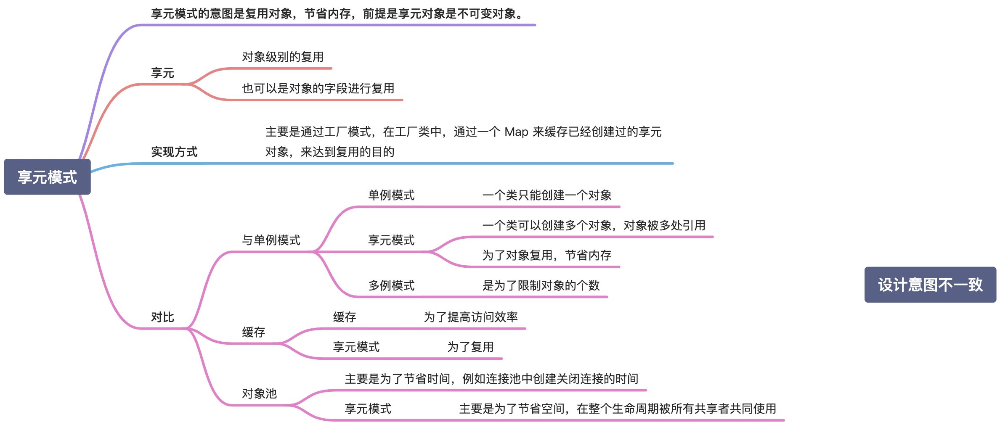

##### 享元模式

#### 象棋 示例

1. 每一个 移动的棋子 可以通过 享元 来 共用【定义一个棋子结构体 ChessPieceUnit】
2. 记录 每个棋子 的位置【定义 一个包含 棋子、X坐标、Y坐标 的 ChessPiece 结构体】
3. 记录 棋盘 落子 的位置【定义 一个 map 类型的 ChessPieceBoard 结构体 value 为 棋子结构体（ChessPieceUnit）】
4. 初始化 棋子 起始位置，添加 棋子移动操作函数